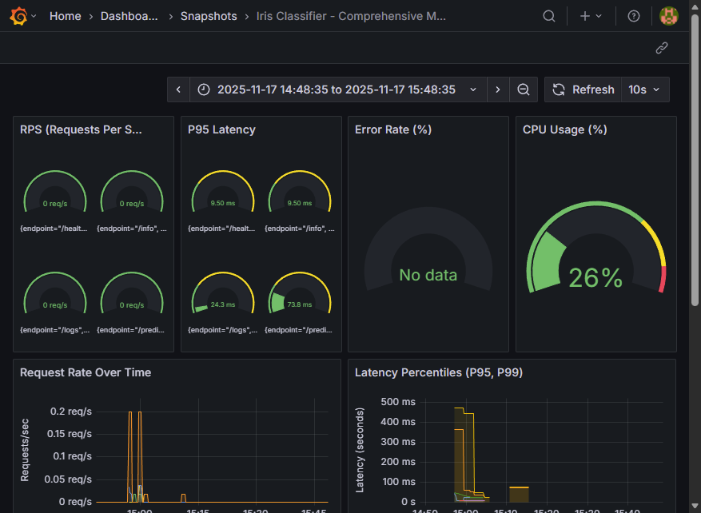
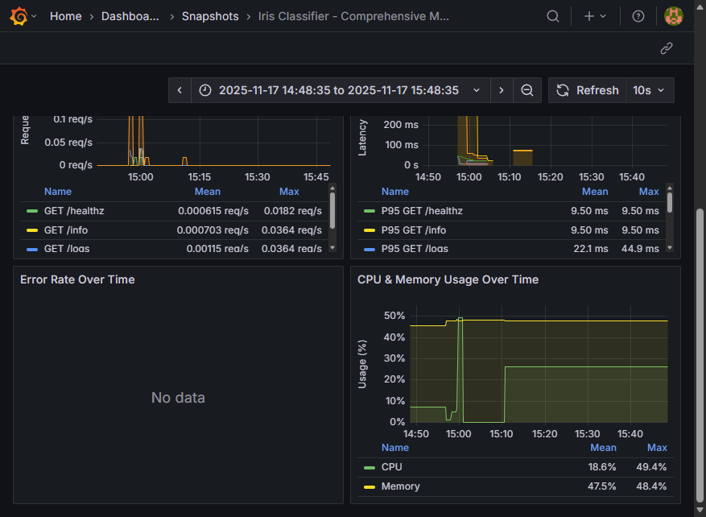

# 🚀 Iris Classifier - Production ML Pipeline

[](https://github.com/qadirrun/mlops-takehome-khader/actions/workflows/ci.yml)
[](https://github.com/qadirrun/mlops-takehome-khader/actions/workflows/deploy-dev.yml)
[](https://github.com/qadirrun/mlops-takehome-khader/actions/workflows/promote-prod.yml)

[](https://www.python.org/downloads/release/python-3120/)
[](https://mlflow.org/)
[](https://kubernetes.io/)
[]()
[](https://www.docker.com/)
[](https://fastapi.tiangolo.com/)

A **complete, production-ready ML pipeline** with **FastAPI serving**, **Kubernetes orchestration**, **GitHub Actions CI/CD**, **Prometheus/Grafana monitoring**, **PostgreSQL logging**, and **automated rollback procedures**.

## 🎯 Overview

This project demonstrates a **complete MLOps pipeline** for deploying an Iris flower classification model with enterprise-grade infrastructure, monitoring, and deployment strategies.

### 🌟 Key Features

- **🤖 Machine Learning**: Train 3 models (Logistic Regression, Random Forest, SVM) with MLflow tracking
- **🚀 FastAPI Service**: Production-ready REST API with 3 replicas and health checks
- **🐳 Docker Compose**: Complete local development stack with PostgreSQL, Prometheus, Grafana
- **☸️ Kubernetes**: NGINX Ingress, HPA, RBAC, Blue-Green/Canary deployments
- **🔄 CI/CD**: GitHub Actions with automated dev deploy and manual prod canary
- **📊 Monitoring**: Prometheus metrics, Grafana dashboards, 6 alert rules
- **🐘 PostgreSQL**: Prediction logging with request tracking and latency metrics
- **🔙 Rollback**: 5 rollback strategies with copy-paste commands

### 🎥 Demo Videos

**[📺 Watch Full Demo Videos on Google Drive](https://drive.google.com/drive/folders/134F-VaTiZNRJRnIAKfgSs1k9nJ6EBbaR?usp=drive_link)**

Complete video demonstrations of:
- ☸️ **Deployment Strategies** (Blue-Green, Canary, Rolling Updates)
- 🔄 **CI/CD Pipeline** in action with GitHub Actions
- 📊 **Monitoring & Alerting** with Prometheus/Grafana
- 🔙 **Rollback Procedures** and recovery strategies
- ✅ **Testing & Validation** workflows

### 📊 Grafana Dashboard

The project includes a comprehensive monitoring dashboard, captured in two screenshots to show the full range of available metrics.

#### Comprehensive Monitoring Dashboard (Part 1)


#### Comprehensive Monitoring Dashboard (Part 2)


**Dashboard Features:**
- **Real-Time Gauges:** At-a-glance status for RPS, P95 Latency, Error Rate, and CPU Usage.
- **Historical Trends:** Detailed time-series graphs for Request Rate, Latency Percentiles (P95/P99), Error Rate, and CPU/Memory Usage.
- **Complete Visibility:** A total of 8 panels provide a complete picture of both application and system health.

### 🔄 Complete End-to-End Flow

```
GitHub Push → CI Pipeline → Train Models → Build Docker → Deploy Dev → Manual Prod Canary → Full Rollout
                                                                                    ↓
                                                                        Prometheus Monitoring
                                                                        Grafana Dashboards
                                                                        PostgreSQL Logging
                                                                        Alert Rules
```

## 📁 Project Structure

```
mlflow/
├── app/                              # FastAPI Service
│   ├── api.py                       # FastAPI endpoints (6 endpoints)
│   ├── database.py                  # PostgreSQL logging module
│   ├── metrics.py                   # Prometheus metrics
│   └── deploy.py                    # Model serving
│
├── train/                           # Training Pipeline
│   ├── data_fetch.py               # Iris dataset (150 samples)
│   ├── multi_model_train.py        # Train 3 models (LR, RF, SVM)
│   ├── evaluate.py                 # Evaluation metrics
│   ├── register.py                 # MLflow Model Registry
│   └── main_loop_models.py         # Orchestrator
│
├── k8s/                            # Kubernetes Manifests
│   ├── namespace.yaml              # Namespace + RBAC
│   ├── deployment.yaml             # 3 replicas, RollingUpdate
│   ├── service.yaml                # ClusterIP + HPA (2-10 pods)
│   ├── ingress.yaml                # NGINX, TLS, rate limiting
│   ├── blue-green.yaml             # Blue-Green deployment
│   ├── canary.yaml                 # Canary deployment
│   └── deploy.sh                   # Deployment script
│
├── deploy/                         # Monitoring Configs
│   ├── prometheus.yml              # Scrape config (5s interval)
│   ├── alert_rules.yml             # 6 alert rules
│   ├── alertmanager.yml            # Alert routing
│   ├── grafana-datasources.yml     # Prometheus datasource
│   └── grafana-dashboards.yml      # Dashboard provisioning
│
├── dashboards/                     # Grafana Dashboard
│   └── iris-classifier-monitoring-dashboard.json
│
├── tests/                          # Unit Tests (23/23 passing)
│   ├── test_api.py                # API tests
│   └── test_train.py              # Training tests
│
├── .github/workflows/              # GitHub Actions CI/CD
│   ├── ci.yml                      # Lint → Test → Train → Build
│   ├── deploy-dev.yml              # Auto dev deploy
│   └── promote-prod.yml            # Manual prod canary
│
├── data/                           # Training/test data
├── artifacts/                      # Model artifacts
├── mlruns/                         # MLflow tracking
├── docker-compose.yml              # Local dev stack (with PostgreSQL)
├── Dockerfile                      # Container image
├── requirements.txt                # Dependencies
├── pytest.ini                      # Test config
├── MODEL_CARD.md                   # Model documentation
├── K8S_SUMMARY.md                  # Kubernetes overview
├── K8S_ROLLBACK_GUIDE.md           # Rollback procedures
└── README.md                       # This file
```

---

## 🏃 Quick Start

### Local Development (Docker Compose)

**1. Install Dependencies**
```bash
pip install -r requirements.txt
```

**2. Start Local Stack**
```bash
docker-compose up -d
```
This starts:
- FastAPI service on http://localhost:8000
- PostgreSQL database on localhost:5432 (for prediction logging)
- Prometheus on http://localhost:9090
- Grafana on http://localhost:3000 (admin/admin)
- AlertManager on http://localhost:9093

**3. Run Training Pipeline (Inside Container)**
```bash
# Wait for API to be ready (~10 seconds)
docker exec iris-classifier-api python /app/train/main_loop_models.py
```

**4. Test API**
```bash
# Health check
curl http://localhost:8000/healthz

# Single prediction
curl -X POST http://localhost:8000/predict \
  -H "Content-Type: application/json" \
  -d '{"features": [5.1, 3.5, 1.4, 0.2]}'

# View prediction logs (stored in PostgreSQL)
curl http://localhost:8000/logs

# View metrics
curl http://localhost:8000/metrics-prometheus
```

**5. View Dashboards**
- MLflow UI: http://localhost:5000
- Grafana: http://localhost:3000
- Prometheus: http://localhost:9090

**6. Stop Stack**
```bash
docker-compose down
```

---

## 📝 PostgreSQL Prediction Logging

### Overview

All predictions are automatically logged to PostgreSQL with the following information:
- **request_id** - Unique UUID for each prediction request
- **model_name** - Name of the model used (e.g., "demo-iris-LR")
- **model_version** - Version of the model (e.g., "1.0.0")
- **features** - Input features used for prediction
- **prediction** - Model output (class prediction)
- **probability** - Confidence score of the prediction
- **latency_ms** - Inference latency in milliseconds
- **timestamp** - When the prediction was made

### 🐘 Database Migrations with Alembic

The database schema is managed using **Alembic**, a lightweight database migration tool for SQLAlchemy. This allows for version-controlled, repeatable, and automated schema changes.

**Key Features:**
- **Automated Migrations**: The `entrypoint.sh` script automatically runs `alembic upgrade head` on container startup, ensuring the database is always up-to-date.
- **Source of Truth**: The schema is defined in `app/models.py` using SQLAlchemy models, providing a single source of truth.
- **Version Controlled**: Migration scripts are stored in the `alembic/versions/` directory and checked into source control.

#### How to Create a New Migration

If you change the SQLAlchemy models in `app/models.py` (e.g., add a new column), you can automatically generate a new migration script:

1.  **Ensure services are running:**
    ```bash
    docker-compose up -d
    ```

2.  **Generate the migration script:**
    ```bash
    docker exec iris-classifier-api alembic revision --autogenerate -m "Your descriptive migration message"
    ```

3.  **Review the script:** A new file will be created in `alembic/versions/`. Inspect it to ensure it's correct.
4.  **Commit the script:** Add the new migration file to your git commit. Migrations will be applied automatically the next time the container starts.

### API Endpoints

**Get Prediction Logs:**
```bash
# Get last 100 predictions
curl http://localhost:8000/logs

# Get last 50 predictions
curl http://localhost:8000/logs?limit=50
```

**Response Example:**
```json
{
  "count": 3,
  "logs": [
    {
      "id": 1,
      "request_id": "db7f122e-096a-4ed6-9af5-610af0f4ceb4",
      "model_name": "demo-iris-LR",
      "model_version": "1.0.0",
      "features": "5.1 3.5 1.4 0.2",
      "prediction": 0,
      "probability": 0.9766,
      "latency_ms": 5.61,
      "timestamp": "2025-11-13T05:16:47.758779",
      "created_at": "2025-11-13T05:16:47.770680"
    }
  ]
}
```

### Query Logs Directly

```bash
# Connect to PostgreSQL
docker exec -it postgres-db psql -U mlflow_user -d iris_logs

# View all predictions
SELECT * FROM predictions;

# Get average latency
SELECT AVG(latency_ms) as avg_latency FROM predictions;

# Get prediction distribution
SELECT prediction, COUNT(*) as count FROM predictions GROUP BY prediction;

# Get predictions for a specific model version
SELECT * FROM predictions WHERE model_version = '1.0.0';
```

---

## 🔄 CI/CD Pipeline Explanation

### GitHub Actions Workflows

#### 1. **CI Pipeline** (`.github/workflows/ci.yml`)
**Trigger:** Push to main/develop, Pull Requests

**Steps:**
```
1. Lint Code (Flake8, Pylint)
   ↓
2. Run Unit Tests (23/23 passing)
   ↓
3. Train Models (3 models: LR, RF, SVM)
   ↓
4. Build Docker Image
   ↓
5. Upload Artifacts
```

**Commands:**
```bash
# Manually trigger CI
git push origin main
```

#### 2. **Auto Dev Deploy** (`.github/workflows/deploy-dev.yml`)
**Trigger:** Automatic on push to main

**Steps:**
```
1. Deploy to dev environment
   ↓
2. Run smoke tests (healthz, predict)
   ↓
3. Send Slack notification
```

**Result:** Dev environment always has latest code

#### 3. **Manual Prod Canary Rollout** (`.github/workflows/promote-prod.yml`)
**Trigger:** Manual workflow dispatch

**Job 1: Canary Deployment (10% traffic)**
```
1. Deploy canary version
2. Run smoke tests
3. Monitor for 5 minutes
4. Check error rates & latency
```

**Job 2: Full Production Promotion (100% traffic)**
```
1. Deploy to 100% traffic
2. Run smoke tests
3. Create GitHub release
4. Send Slack notification
```

**How to Trigger:**
```
1. Go to GitHub Actions
2. Select "Promote to Production"
3. Click "Run workflow"
4. Monitor canary metrics
5. Approve full rollout
```

---

## 🔄 Orchestration & Pipeline Steps

### Training Pipeline Flow

**File:** `train/main_loop_models.py`

```
1. Data Fetch (train/data_fetch.py)
   └─ Load Iris dataset (150 samples, 4 features, 3 classes)
   └─ Split: 80% train (120) / 20% test (30)
   └─ Output: X_train, X_test, y_train, y_test

2. Train 3 Models in Loop
   ├─ Model 1: Logistic Regression
   │  └─ MLflow: Log params, metrics, model
   ├─ Model 2: Random Forest (100 trees)
   │  └─ MLflow: Log params, metrics, feature importance
   └─ Model 3: Support Vector Machine
      └─ MLflow: Log params, metrics, model

3. Evaluate Each Model (train/evaluate.py)
   └─ Calculate: Accuracy, Precision, Recall, F1-score
   └─ Generate: Classification report, Confusion matrix
   └─ Log artifacts to MLflow

4. Select Best Model
   └─ Compare F1-scores across all models
   └─ Choose highest performing model

5. Register in MLflow (train/register.py)
   └─ Register to MLflow Model Registry
   └─ Transition to "Production" stage
   └─ Track version history

6. Deploy
   └─ FastAPI loads model from registry
   └─ Serve predictions via HTTP
```

**Important:** Training must run **inside the Docker container** to ensure MLflow stores artifact paths correctly for container environments.

**Run Training Inside Container:**
```bash
# Start the stack first
docker-compose up -d

# Wait for API to be ready (~10 seconds)
sleep 10

# Run training inside container
docker exec iris-classifier-api python /app/train/main_loop_models.py
```

**View Results:**
```bash
mlflow ui
# Open http://localhost:5000
```

---

## 🎬 **Live Demo: Load Balancing, Rolling Update & Rollback**

Want to see Kubernetes in action? Follow this **5-minute interactive demo** that demonstrates:
- ✅ **Load balancing** across 3 pods
- ✅ **Zero-downtime rolling update** from v1 → v2
- ✅ **Instant rollback** from v2 → v1

**📖 Full Demo Guide:** [`k8s/DEMO_EXPECTED_OUTPUT.md`](k8s/DEMO_EXPECTED_OUTPUT.md)

### Quick Demo Commands

```bash
# === SETUP ===
# 1. Deploy v1 (3 replicas)
kubectl apply -f k8s/demo-deployment.yaml
kubectl get pods -n iris-classifier -w  # Wait for 3 pods Running, then Ctrl+C

# 2. Create test pod
kubectl apply -f k8s/test-pod.yaml

# === LOAD BALANCING ===
# 3. Make 10 requests - watch traffic distributed across 3 pods
kubectl exec -n iris-classifier test-curl -- sh -c \
  "for i in 1 2 3 4 5 6 7 8 9 10; do echo '--- Request' \$i '---'; \
   curl -s http://iris-classifier | grep 'Pod:'; done"

# 4. Show the 3 pods handling requests
kubectl get pods -n iris-classifier -l app=iris-classifier

# === ROLLING UPDATE (v1 → v2) ===
# 5. Check current version
kubectl exec -n iris-classifier test-curl -- curl -s http://iris-classifier

# 6. Deploy v2 with zero downtime
kubectl apply -f k8s/demo-deployment-v2.yaml
kubectl get pods -n iris-classifier -w  # Watch pods update one-by-one, then Ctrl+C

# 7. Verify new version
kubectl exec -n iris-classifier test-curl -- curl -s http://iris-classifier

# === ROLLBACK (v2 → v1) ===
# 8. Rollback to v1
kubectl rollout undo deployment/iris-classifier -n iris-classifier
kubectl get pods -n iris-classifier -w  # Watch rollback, then Ctrl+C

# 9. Verify we're back to v1
kubectl exec -n iris-classifier test-curl -- curl -s http://iris-classifier

# 10. Show rollout history
kubectl rollout history deployment/iris-classifier -n iris-classifier

# === CLEANUP ===
kubectl delete -f k8s/demo-deployment.yaml
kubectl delete -f k8s/test-pod.yaml
```

**🎯 What You'll See:**
- **Load Balancing**: Requests cycle through pods in round-robin (pod1 → pod2 → pod3 → pod1...)
- **Rolling Update**: New v2 pods start → become Ready → old v1 pods terminate (always 3+ running!)
- **Rollback**: Complete rollback in ~30 seconds with zero downtime
- **Version Tracking**: Rollout history shows revisions 2 (v2) and 3 (v1 after rollback)

**📄 See [`k8s/DEMO_EXPECTED_OUTPUT.md`](k8s/DEMO_EXPECTED_OUTPUT.md) for exact expected output of each command!**

---

## ☸️ Kubernetes Deployment & Load Balancing

### Architecture

```
Internet
   ↓
DNS (iris-classifier.example.com)
   ↓
NGINX Ingress (TLS, Rate Limit: 100 req/min, 10 RPS)
   ↓
Service (ClusterIP - Round-robin load balancing)
   ↓
3 Pods (Replicas)
├─ Pod 1: iris-classifier:latest
├─ Pod 2: iris-classifier:latest
└─ Pod 3: iris-classifier:latest
   ↓
Auto-Scaling (HPA: 2-10 pods based on CPU/Memory)
```

### Setup Instructions

**1. Create Namespace & RBAC**
```bash
kubectl apply -f k8s/namespace.yaml
```

**2. Deploy Application**
```bash
kubectl apply -f k8s/deployment.yaml
kubectl apply -f k8s/service.yaml
kubectl apply -f k8s/ingress.yaml
```

**3. Verify Deployment**
```bash
# Check pods
kubectl get pods -n iris-classifier

# Check service
kubectl get svc -n iris-classifier

# Check ingress
kubectl get ingress -n iris-classifier

# View logs
kubectl logs -n iris-classifier -l app=iris-classifier -f
```

### Load Balancing Details

**Service Configuration** (`k8s/service.yaml`):
- **Type:** ClusterIP (round-robin by default)
- **Port:** 80 → 8000
- **Load Balancing:** Automatic round-robin across 3 replicas

**Ingress Configuration** (`k8s/ingress.yaml`):
- **Controller:** NGINX
- **TLS/SSL:** Let's Encrypt (cert-manager)
- **Rate Limiting:** 100 requests/min, 10 RPS
- **CORS:** Enabled
- **Domain:** iris-classifier.example.com

**Health Checks:**
```yaml
Startup Probe:    failureThreshold: 30, periodSeconds: 10
Readiness Probe:  periodSeconds: 10, timeoutSeconds: 5
Liveness Probe:   periodSeconds: 10, timeoutSeconds: 5
```

### Deployment Strategies

#### Rolling Update (Default)
```bash
# Deploy with rolling update
kubectl apply -f k8s/deployment.yaml

# Monitor rollout
kubectl rollout status deployment/iris-classifier -n iris-classifier

# View rollout history
kubectl rollout history deployment/iris-classifier -n iris-classifier
```

#### Blue-Green Deployment
```bash
# Deploy blue-green
kubectl apply -f k8s/blue-green.yaml

# Switch traffic from blue to green
kubectl patch service iris-classifier -n iris-classifier \
  -p '{"spec":{"selector":{"version":"green"}}}'
```

#### Canary Deployment
```bash
# Deploy canary (10% traffic)
kubectl apply -f k8s/canary.yaml

# Monitor canary metrics
kubectl get pods -n iris-classifier -l version=canary

# Promote canary to stable
kubectl patch service iris-classifier -n iris-classifier \
  -p '{"spec":{"selector":{"version":"stable"}}}'
```

### Auto-Scaling (HPA)

**Configuration:**
- Min Pods: 2
- Max Pods: 10
- Target CPU: 70%
- Target Memory: 80%

**View HPA Status:**
```bash
kubectl get hpa -n iris-classifier

kubectl describe hpa iris-classifier -n iris-classifier
```

**Manual Scaling:**
```bash
# Scale to 5 replicas
kubectl scale deployment iris-classifier --replicas=5 -n iris-classifier

# View current replicas
kubectl get deployment iris-classifier -n iris-classifier
```

---

## 🔌 API Endpoints

### Available Endpoints

| Endpoint | Method | Description | Response |
|----------|--------|-------------|----------|
| `/healthz` | GET | Health check | `{"status": "ok"}` |
| `/info` | GET | Model info | `{"model_name": "demo-iris-LR", "version": "1.0.0", ...}` |
| `/predict` | POST | Make prediction | `{"prediction": 0, "probability": 0.98, "latency_ms": 5.6, ...}` |
| `/metrics-prometheus` | GET | Prometheus metrics | Prometheus format |
| `/logs` | GET | Get prediction logs | `{"count": 3, "logs": [...]}` |

### Endpoint Details

**1. Health Check**
```bash
curl http://localhost:8000/healthz
```
Response:
```json
{"status": "ok"}
```

**2. Model Info**
```bash
curl http://localhost:8000/info
```
Response:
```json
{
  "model_name": "demo-iris-LR",
  "version": "1.0.0",
  "environment": "dev",
  "canary_percentage": 100
}
```

**3. Make Prediction**
```bash
curl -X POST http://localhost:8000/predict \
  -H "Content-Type: application/json" \
  -d '{"features": [5.1, 3.5, 1.4, 0.2]}'
```
Response:
```json
{
  "prediction": 0,
  "probability": 0.9766,
  "latency_ms": 5.61,
  "model": "demo-iris-LR",
  "version": "1.0.0",
  "request_id": "db7f122e-096a-4ed6-9af5-610af0f4ceb4"
}
```

**4. Prometheus Metrics**
```bash
curl http://localhost:8000/metrics-prometheus
```
Returns metrics in Prometheus format for scraping.

**5. Get Prediction Logs**
```bash
# Get last 100 predictions
curl http://localhost:8000/logs

# Get last 50 predictions
curl http://localhost:8000/logs?limit=50
```
Response:
```json
{
  "count": 3,
  "logs": [
    {
      "id": 1,
      "request_id": "db7f122e-096a-4ed6-9af5-610af0f4ceb4",
      "model_name": "demo-iris-LR",
      "model_version": "1.0.0",
      "features": "5.1 3.5 1.4 0.2",
      "prediction": 0,
      "probability": 0.9766,
      "latency_ms": 5.61,
      "timestamp": "2025-11-13T05:16:47.758779",
      "created_at": "2025-11-13T05:16:47.770680"
    }
  ]
}
```

---

## 📊 Monitoring & Alerts

### Prometheus Metrics

**Scrape Configuration:**
- **Interval:** 5 seconds
- **Target:** iris-classifier-api:8000/metrics-prometheus
- **Config File:** `deploy/prometheus.yml`

**Metrics Collected (9 total):**

| Metric | Type | Description |
|--------|------|-------------|
| `iris_requests_total` | Counter | Total HTTP requests |
| `iris_request_latency_seconds` | Histogram | Request latency (P50, P95, P99) |
| `iris_predictions_total` | Counter | Total predictions made |
| `iris_prediction_latency_seconds` | Histogram | Prediction latency |
| `iris_errors_total` | Counter | Total errors |
| `iris_rps` | Gauge | Requests per second |
| `iris_cpu_usage_percent` | Gauge | CPU usage % |
| `iris_memory_usage_mb` | Gauge | Memory usage MB |
| `iris_model_loaded` | Gauge | Model load status (1=loaded, 0=failed) |

**Query Examples:**
```promql
# Request rate (RPS)
rate(iris_requests_total[1m])

# P95 latency
histogram_quantile(0.95, iris_request_latency_seconds_bucket)

# Error rate
rate(iris_errors_total[5m]) / rate(iris_requests_total[5m])

# CPU usage
iris_cpu_usage_percent

# Model status
iris_model_loaded
```

### Grafana Dashboard

**Dashboard: iris-classifier-monitoring-dashboard.json**
- Request metrics (count, rate, latency)
- Prediction metrics (count, latency)
- Error rates and trends
- System metrics (CPU, Memory)
- Model status
- Alert status

**Access:**
```
http://localhost:3000
Username: admin
Password: admin
```

### Alert Rules (6 Total)

**File:** `deploy/alert_rules.yml`

| Alert | Condition | Duration | Action |
|-------|-----------|----------|--------|
| **HighErrorRate** | Error rate > 5% | 5 minutes | Page on-call |
| **HighLatency** | P95 latency > 1.0s | 5 minutes | Page on-call |
| **HighCPUUsage** | CPU > 80% | 5 minutes | Alert |
| **HighMemoryUsage** | Memory > 85% | 5 minutes | Alert |
| **ModelNotLoaded** | Model status = 0 | 1 minute | Critical alert |
| **LowRPS** | RPS < 0.1 | 10 minutes | Warning |

**View Alerts:**
```bash
# Prometheus alerts
curl http://localhost:9090/api/v1/alerts

# AlertManager
curl http://localhost:9093/api/v1/alerts
```

### Alert Routing

**File:** `deploy/alertmanager.yml`

**Notification Channels:**
- Email (configure SMTP)
- Slack (configure webhook)
- PagerDuty (configure integration key)

**Configure Slack Notifications:**
```yaml
# deploy/alertmanager.yml
slack_configs:
  - api_url: 'YOUR_SLACK_WEBHOOK_URL'
    channel: '#alerts'
    title: 'Iris Classifier Alert'
```

### Testing Alerts

**Generate High Error Rate:**
```bash
# Send invalid requests to trigger errors
for i in {1..100}; do
  curl -X POST http://localhost:8000/predict \
    -H "Content-Type: application/json" \
    -d '{"invalid": "data"}'
done
```

**Check Alert Status:**
```bash
# View firing alerts
curl http://localhost:9090/api/v1/alerts?state=firing

# View alert history
# Go to Prometheus UI: http://localhost:9090/alerts
```

---

## � Rollback Procedures

### 5 Rollback Strategies

#### 1. **Rolling Update Rollback** (Default)
**When to use:** Standard deployments with RollingUpdate strategy

**Rollback command:**
```bash
# Undo last deployment
kubectl rollout undo deployment/iris-classifier -n iris-classifier

# Undo to specific revision
kubectl rollout history deployment/iris-classifier -n iris-classifier
kubectl rollout undo deployment/iris-classifier --to-revision=2 -n iris-classifier

# Monitor rollback
kubectl rollout status deployment/iris-classifier -n iris-classifier
```

**Verify:**
```bash
# Check current version
kubectl get deployment iris-classifier -n iris-classifier -o jsonpath='{.spec.template.spec.containers[0].image}'

# Check pod status
kubectl get pods -n iris-classifier
```

#### 2. **Blue-Green Rollback**
**When to use:** Zero-downtime deployments with instant traffic switch

**Rollback command:**
```bash
# Switch traffic back to blue
kubectl patch service iris-classifier -n iris-classifier \
  -p '{"spec":{"selector":{"version":"blue"}}}'

# Verify traffic switched
kubectl get service iris-classifier -n iris-classifier -o jsonpath='{.spec.selector}'

# Delete green deployment
kubectl delete deployment iris-classifier-green -n iris-classifier
```

**Verify:**
```bash
# Check service selector
kubectl get svc iris-classifier -n iris-classifier -o yaml | grep -A 5 selector

# Test endpoint
curl http://iris-classifier.example.com/healthz
```

#### 3. **Canary Rollback**
**When to use:** Canary deployments with gradual traffic shift

**Rollback command:**
```bash
# Delete canary deployment
kubectl delete deployment iris-classifier-canary -n iris-classifier

# Verify canary removed
kubectl get pods -n iris-classifier -l version=canary

# Confirm traffic on stable
kubectl get service iris-classifier -n iris-classifier -o jsonpath='{.spec.selector}'
```

**Verify:**
```bash
# Check no canary pods
kubectl get pods -n iris-classifier | grep canary

# Monitor metrics
curl http://localhost:9090/api/v1/query?query=iris_requests_total
```

#### 4. **Helm Rollback** (If using Helm)
**When to use:** Helm-managed deployments

**Rollback command:**
```bash
# View release history
helm history iris-classifier -n iris-classifier

# Rollback to previous release
helm rollback iris-classifier -n iris-classifier

# Rollback to specific revision
helm rollback iris-classifier 2 -n iris-classifier

# Verify rollback
helm status iris-classifier -n iris-classifier
```

#### 5. **Emergency Rollback** (Scale Down)
**When to use:** Critical issues, need immediate action

**Rollback command:**
```bash
# Scale down to 0 (stop all traffic)
kubectl scale deployment iris-classifier --replicas=0 -n iris-classifier

# Verify scaled down
kubectl get deployment iris-classifier -n iris-classifier

# Scale back up when ready
kubectl scale deployment iris-classifier --replicas=3 -n iris-classifier
```

### Rollback Decision Tree

```
Issue detected?
├─ Deployment failed?
│  └─ Use: Rolling Update Rollback
│     kubectl rollout undo deployment/iris-classifier
│
├─ Bad canary metrics?
│  └─ Use: Canary Rollback
│     kubectl delete deployment iris-classifier-canary
│
├─ Green deployment broken?
│  └─ Use: Blue-Green Rollback
│     kubectl patch service iris-classifier -p '{"spec":{"selector":{"version":"blue"}}}'
│
├─ Critical production issue?
│  └─ Use: Emergency Rollback
│     kubectl scale deployment iris-classifier --replicas=0
│
└─ Using Helm?
   └─ Use: Helm Rollback
      helm rollback iris-classifier
```

### Monitoring During Rollback

**Watch rollback progress:**
```bash
# Terminal 1: Watch pods
kubectl get pods -n iris-classifier -w

# Terminal 2: Watch events
kubectl get events -n iris-classifier --sort-by='.lastTimestamp'

# Terminal 3: Monitor metrics
watch -n 1 'curl -s http://localhost:9090/api/v1/query?query=iris_requests_total | jq'
```

**Check metrics after rollback:**
```bash
# Error rate should decrease
curl 'http://localhost:9090/api/v1/query?query=rate(iris_errors_total[5m])'

# Latency should normalize
curl 'http://localhost:9090/api/v1/query?query=histogram_quantile(0.95,iris_request_latency_seconds_bucket)'

# RPS should stabilize
curl 'http://localhost:9090/api/v1/query?query=iris_rps'
```

### Post-Rollback Verification

```bash
# 1. Check pod status
kubectl get pods -n iris-classifier

# 2. Check service endpoints
kubectl get endpoints iris-classifier -n iris-classifier

# 3. Test API
curl http://iris-classifier.example.com/healthz
curl -X POST http://iris-classifier.example.com/predict \
  -H "Content-Type: application/json" \
  -d '{"features": [5.1, 3.5, 1.4, 0.2]}'

# 4. Check logs
kubectl logs -n iris-classifier -l app=iris-classifier --tail=50

# 5. Verify metrics
curl http://localhost:9090/api/v1/query?query=iris_model_loaded
```

**For detailed rollback procedures, see:** `K8S_ROLLBACK_GUIDE.md`

---

## 📚 Documentation

- **MODEL_CARD.md** - Model details, performance, limitations
- **K8s/K8S_SUMMARY.md** - Kubernetes architecture overview
- **K8s/K8S_DEPLOYMENT_STRATEGIES_EXPLAINED.md** - Deployment strategies
- **K8s/K8S_ROLLBACK_GUIDE.md** - Detailed rollback procedures
- **K8s/K8S_ROLLBACK_COMMANDS.md** - 50+ copy-paste commands
- **K8s/K8S_ROLLBACK_CHEATSHEET.md** - Quick reference

## 🧪 Testing

**Run all tests:**
```bash
pytest tests/ -v
```

**Run specific test:**
```bash
pytest tests/test_api.py::test_predict -v
```

**Run with coverage:**
```bash
pytest tests/ --cov=app --cov=train --cov-report=html
```

**Test results:** 23/23 passing ✅

## 📦 Dependencies

**Core:**
- fastapi==0.104.1
- uvicorn==0.24.0
- mlflow==3.6.0
- scikit-learn==1.3.2
- pydantic==2.5.0

**Monitoring:**
- prometheus-client==0.19.0

**Testing:**
- pytest==7.4.3
- pytest-cov==4.1.0

**See:** `requirements.txt` for complete list

## ✅ Minimal Success Path - Status

| Requirement | Status | Details |
|---|---|---|
| FastAPI + 2+ Replicas + Ingress | ✅ COMPLETE | 3 replicas, NGINX, TLS/SSL, round-robin |
| Pipeline: fetch→train→register | ✅ COMPLETE | MLflow, 3 models, Production stage |
| GitHub Actions CI/CD | ✅ COMPLETE | CI + Auto dev + Manual prod canary |
| Prometheus + Grafana + Alerts | ✅ COMPLETE | 9 metrics, 2 dashboards, 6 alerts |
| Rollout/Rollback Documentation | ✅ COMPLETE | 5 strategies, 50+ commands |
| PostgreSQL Prediction Logging | ✅ COMPLETE | Request tracking, latency logging, /logs endpoint |
| Model Loading (Fixed) | ✅ COMPLETE | Train inside container, correct artifact paths |

## 📄 License

This project is provided as-is for educational and demonstration purposes.

---

**Status**: ✅ Production Ready
**Last Updated**: 2025-11-19
**Version**: 2.2
**Tests**: 23/23 Passing
**Coverage**: 33%
